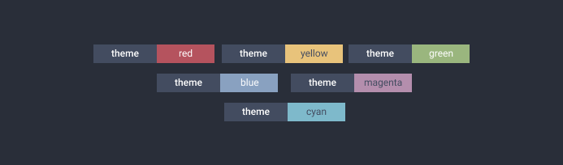

# Themes



Themes are a way to store badge configuration for repeated use. All the options (_except for the theme option, obviously_) that are needed by the badge can be stored by making a theme.

## All themes

|         |                                           |           |                                               |
| ------- | ----------------------------------------- | --------- | --------------------------------------------- |
| `blue`  |    | `cyan`    |        |
| `green` |  | `magenta` |  |
| `red`   |      | `yellow`  |    |

You can also **swap** all themes, this means properties from label will be aplied to message and vice versa.

## Inbuilt Themes

- **red** : Red Message Background
- **green** : Green Message Background
- **blue** : Blue Message Background
- **yellow** : Black Colored Message on Yellow Background
- **cyan** : Black Colored Message on Cyan Background
- **magenta** : Black Colored Message on Magenta Background
- **success** : (_'Success'_) Message on Green Background
- **failed** : (_'Failed'_) Message on Red Background

## Using Themes

You can use the themes in various ways, passing an option `theme` to badge:

```js
badge('label', 'green', { theme: 'green' });
badge('label', 'magenta', { theme: 'magenta', swapTheme: true });
```

Or there are helper methods for ease of use:

```js
badge.green('label', 'green');
badge.failed('theme', 'red');
```

## Adding a theme

You can also add you own themes:

```js
badge.addTheme('donate', {
  label: '❤️ donate',
});

badge('', 'ko-fi', { theme: 'donate' });
badge.donate('', 'ko-fi');
```


> You can also send in a PR and suggest a new inbuilt theme :)

## Swap Properties

You can also **swap** all themes, this means properties from label will be aplied to message and vice versa.

```js
badge.failed('theme', 'red');
badge.failed.swap('theme', 'red');
```


## Contributing 💕

You can add your themes for review, just follow this simple steps:

1. Add your theme config in file [`themes.js`](../themes.js).
2. Send a PR and I will review the theme and hopefully add it 💪.
